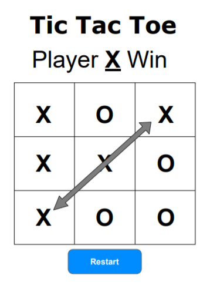
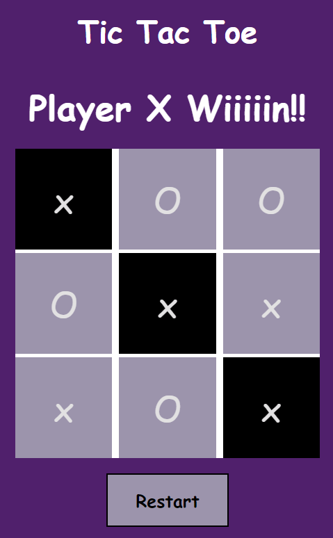

# Tic Tac Toe

Tic Tac Toe is a game for two players, X and O, who take turns marking the spaces in a 3×3 grid. The player who succeeds in placing three of their marks in a diagonal, horizontal, or vertical row is the winner.  In the case of a tie, the users will be asked to play the game again.

## Wireframe
Here are the original wireframe for this project. 

## User Stories
* As a user, I should be able to start a new tic tac toe game
* As a user, I should be able to click on a square to add X first and then O, and so on
* As a user, I should be shown a message after each turn for if I win, lose, tie or who's turn it is next
* As a user, I should not be able to click the same square twice
* As a user, I should be shown a message when I win, lose or tie
* As a user, I should not be able to continue playing once I win, lose, or tie
* As a user, I should be able to play the game again without refreshing the page

## Technologies used.
* HTML
* CSS
* JavaScript
* JQuery

## The Game 
Here is a screenshot for this game, which gives a response when the user wins. 

### Links
* Live - <a href= 'https://pages.git.generalassemb.ly/fatmahhelal/Tic-Tac-Toe-fatimah/'> Here </a>
* Github - <a href= 'https://git.generalassemb.ly/fatmahhelal/Tic-Tac-Toe-fatimah'> Here </a>